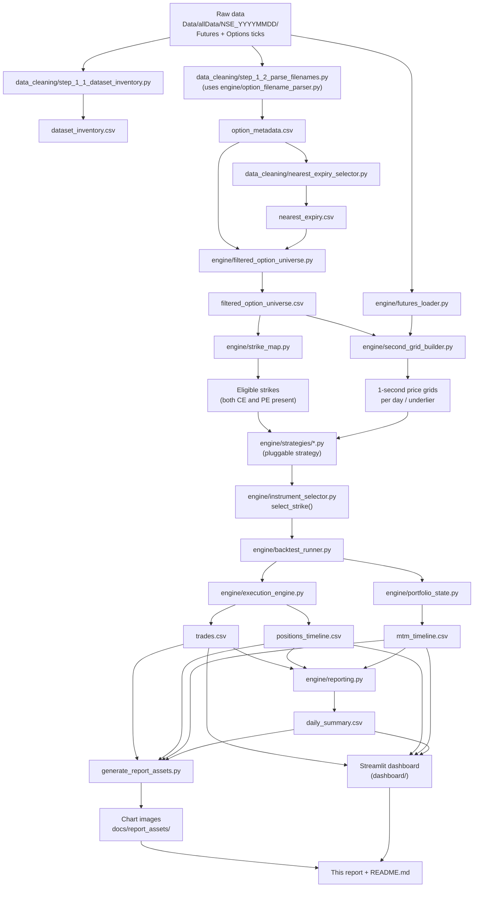
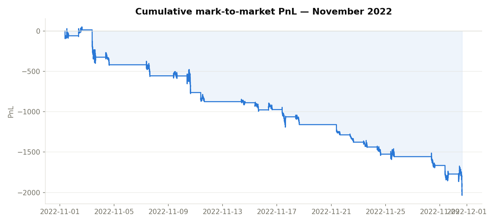
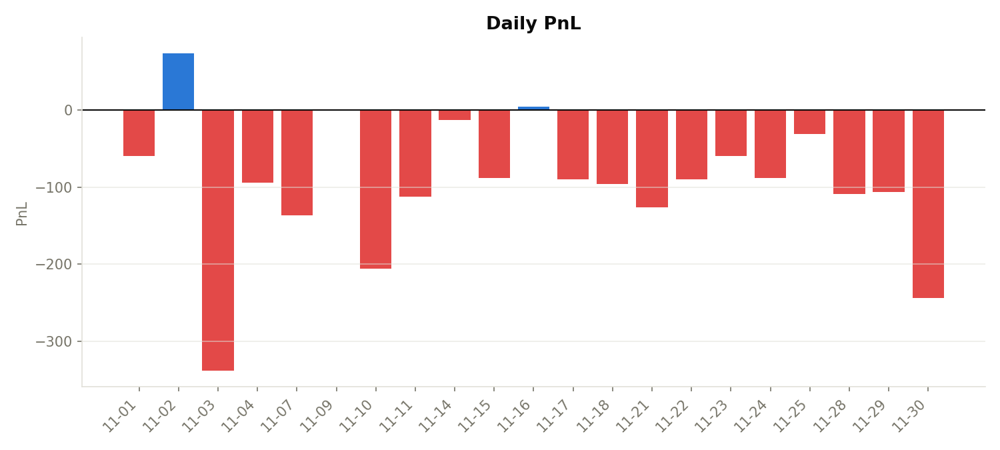
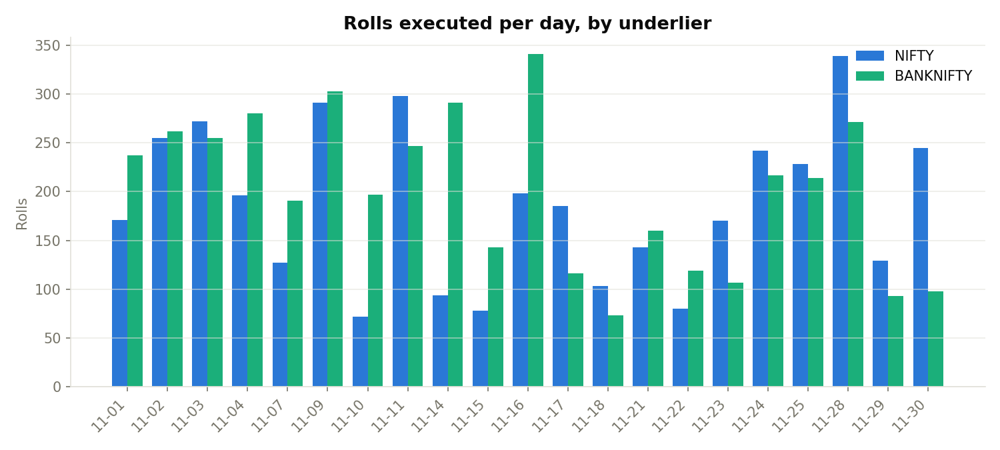
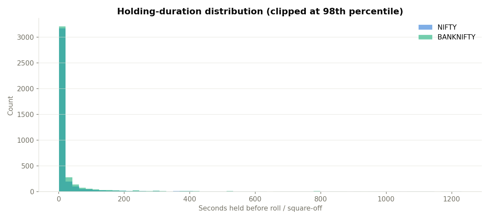
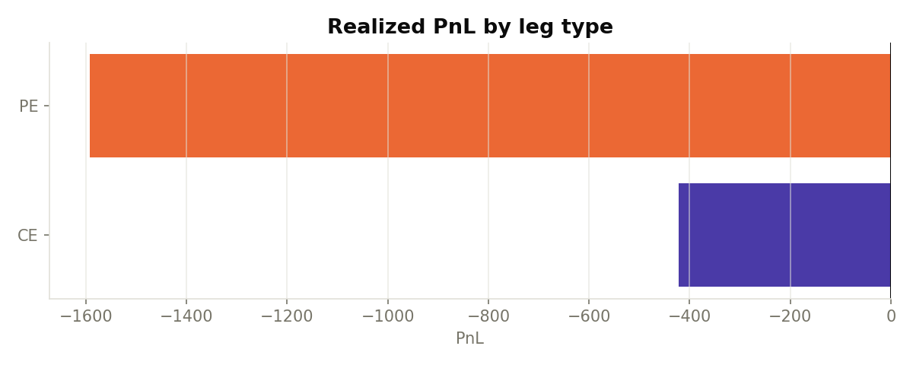
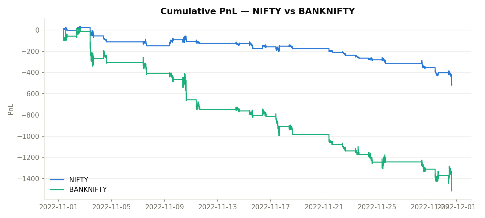
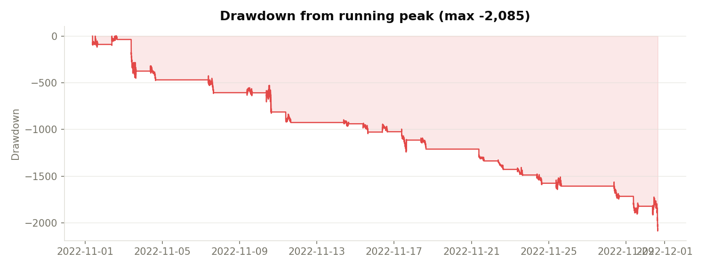
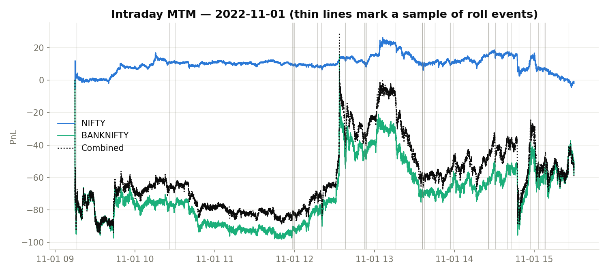
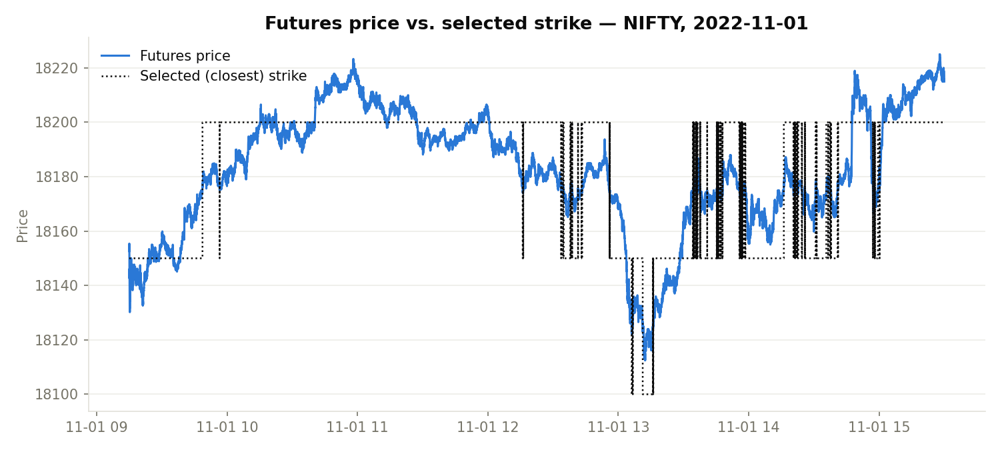

# Project Report — NSE Options Intraday Backtesting Engine

A backtest of an intraday closest-strike options straddle over one month
(November 2022) of NSE tick data, for **NIFTY** and **BANKNIFTY**. This report
walks through the full pipeline — raw ticks in, results out — one stage at a
time, then walks through every result the same way: which files produced it
and how to read it. It is meant to be readable on its own, without opening the
code or the live dashboard.

> For the exhaustive version (assumptions, full architecture rationale,
> limitations) see [`README.md`](README.md). This report is the flow-first
> companion to it.

---

## 1. Project flowchart

Every box below is a real file in this repo; every arrow is an actual data
dependency (input file → script → output file).



`run_strategy.py` is the single command that walks the whole left-to-right
chain above for one or every registered strategy in one run
(`python run_strategy.py --all`); the sections below unpack each box.

---

## 2. Build narrative — what I ran, in order, to get from raw ticks to results

**Step 1 — confirm the data is what the assignment says it is.**
I ran `data_cleaning/step_1_1_dataset_inventory.py` against `Data/allData/` to
walk all 21 `NSE_YYYYMMDD` folders, confirm both `NIFTY-I.csv` and
`BANKNIFTY-I.csv` exist for every day, and count option files per underlier —
producing `results/dataset_inventory.csv`. No missing futures files, no
unreadable folders.

**Step 2 — turn every option filename into structured metadata.**
Option identity is encoded entirely in the filename
(`NIFTY22110318150CE.csv` → underlier, expiry, strike, type), so I wrote
`engine/option_filename_parser.py` (a pure parser, unit-testable in isolation)
and ran it over every file via `data_cleaning/step_1_2_parse_filenames.py`,
producing `results/option_metadata.csv` — **31,319 filenames parsed, 0
failures.**

**Step 3 — work out which expiry is "nearest" on each day.**
`data_cleaning/nearest_expiry_selector.py` reads `option_metadata.csv` and, per
`(trade_date, underlier)`, picks the earliest expiry date that is still ≥ the
trading date — producing `results/nearest_expiry.csv`. Verified against the
assignment's own example: 2022-11-01 → NIFTY's nearest expiry is 2022-11-03.

**Step 4 — build the tradable universe for each day.**
`engine/filtered_option_universe.py` joins `option_metadata.csv` against
`nearest_expiry.csv` and keeps only rows whose expiry matches that day's
nearest expiry — producing `results/filtered_option_universe.csv`. This is
the exact set of files the rest of the pipeline is allowed to touch.

**Step 5 — find which strikes actually have both legs.**
`engine/strike_map.py` reads `filtered_option_universe.csv` and, per day and
underlier, keeps only strikes where **both** a CE and a PE file exist
(a strike with only one leg is useless for a straddle) — this is the eligible
strike set every second's "closest strike" search is run against.

**Step 6 — build a uniform 1-second timeline.**
The raw ticks are event-level, not one-row-per-second. `engine/futures_loader.py`
loads and deduplicates `NIFTY-I.csv` / `BANKNIFTY-I.csv` (last tick per second
wins); `engine/second_grid_builder.py` then forward-fills the futures price and
every eligible option's price onto a fixed 22,500-row index
(`09:15:00`–`15:29:59`) per day, per underlier. This grid is what every later
second-by-second decision reads from.

**Step 7 — decide what to hold, every second (the strategy).**
This is the only strategy-specific step in the whole pipeline. For the
assignment strategy, `engine/strategies/closest_strike_straddle.py` calls
`engine/instrument_selector.select_strike()` on that second's futures price and
the eligible-strike list, and — only if both legs are actually priced this
second — returns `{ce_instrument: 1, pe_instrument: 1}` as the desired holding.
(Two more strategy files exist and plug into the exact same pipeline — see §5.)

**Step 8 — turn "what I want to hold" into trades and PnL.**
`engine/backtest_runner.py` drives the whole loop: for each second, it asks the
strategy for its target, then hands the diff between current and target
holdings to `engine/execution_engine.py`, which books SELL-before-BUY fills
into `engine/portfolio_state.py`. Iterating this 22,500 times/day × 21 days × 2
underliers produces the three core outputs: `trades.csv`, `positions_timeline.csv`,
`mtm_timeline.csv`.

**Step 9 — roll it up into a daily summary.**
`engine/reporting.py` reads those three files and produces `daily_summary.csv`
(one row per date × underlier: trade/roll counts, gross PnL, first-entry/
last-roll times, max favorable/adverse excursion) plus an enriched
`trades.csv` with expiry/strike/option_type columns split back out of the
instrument name.

**Step 10 — validate it actually did the right thing.**
Before trusting any of the above, `tests/run_debug_day.py` ran the pipeline on
one real day (2022-11-01, NIFTY) with verbose logging so every second's futures
price, selected strike, and fill could be checked by hand, and
`tests/test_edge_cases.py` ran 5 synthetic scenarios (missing price, duplicate
timestamps, flat day, whipsaw day, already-flat square-off) — all 5 pass.

**Step 11 — produce the charts and this report.**
`generate_report_assets.py` reads the final `results/strategies/closest_strike_straddle/`
files and produces the 9 chart images in `docs/report_assets/` used below,
printing the exact headline numbers cited alongside them.

---

## 3. Results, one at a time

Every chart below is the **`closest_strike_straddle`** strategy (the literal
assignment strategy) across all 21 trading days, both underliers, unless
stated otherwise.

### 3.1 Cumulative mark-to-market PnL



**Flow:** `mtm_timeline.csv` (Step 8) → `generate_report_assets.py` shifts each
day's per-second series up by every prior day's closing PnL (since
`mtm_timeline.csv` resets to zero at the start of each day, per rule 2 — no
overnight carry) → this chart.

**Reading it:** the month closes at **-2,015.30**. The curve steps down in
blocks rather than smoothly — each block is one trading day's net result,
carried forward.

### 3.2 Daily PnL



**Flow:** `daily_summary.csv`'s `gross_pnl` column (Step 9, itself read off the
*last* second of each day's `mtm_timeline.csv` slice) summed across both
underliers per day → this chart.

**Reading it:** only **2 of 21 days** closed positive (2022-11-02: +73.40).
The worst day was 2022-11-03 (-338.30).

### 3.3 Roll frequency



**Flow:** `positions_timeline.csv` (Step 8) → count rows where
`trigger == "ROLL"` (a HOLDING state replacing a *different* prior HOLDING
state) → grouped by day and underlier → this chart.

**Reading it:** **8,131 rolls** across the month (3,916 NIFTY / 4,215
BANKNIFTY), an average of **387 rolls per day**. The strategy re-evaluates the
closest strike every second, so any futures tick that crosses a strike
boundary triggers a roll.

### 3.4 Holding-duration distribution



**Flow:** `positions_timeline.csv` → for each HOLDING row, duration = gap to
the *next* state-change row for that (day, underlier) → this chart.

**Reading it:** median holding time is **4 seconds** (NIFTY 3s, BANKNIFTY 5s).
The strategy is essentially always mid-roll — the direct, visible cause of the
net loss in §3.2.

### 3.5 CE vs. PE leg attribution



**Flow:** `trades.csv` (Step 9) → BUY/SELL fills strictly alternate per
`(trade_date, instrument_name)` since max position is 1, so pairing the
*i*-th BUY with the *i*-th SELL recovers each closed leg's realized PnL →
grouped by `option_type` → this chart.

**Reading it:** CE **-422.30**, PE **-1,593.00** — both legs are net losers, so
this is a bar chart, not a pie (a pie can't represent negative magnitudes; an
earlier version of the dashboard used one here and it silently rendered
blank).

### 3.6 NIFTY vs. BANKNIFTY



**Flow:** same construction as §3.1, kept separate per underlier instead of
combined.

**Reading it:** BANKNIFTY (**-1,507.45**) drove roughly 3× NIFTY's loss
(**-507.85**) — consistent with BANKNIFTY's wider point moves and coarser
(100-point vs. 50-point) strike spacing causing larger, more frequent rolls.

### 3.7 Drawdown



**Flow:** §3.1's cumulative series → `cumulative_pnl - cumulative_pnl.cummax()`
→ this chart.

**Reading it:** maximum drawdown over the month was **-2,085.30**, slightly
worse than the final close — meaning there was a small partial recovery in the
last few days.

### 3.8 One day, start to finish: 2022-11-01



**Flow:** this is the exact day used for manual reconciliation in Step 10 —
`mtm_timeline.csv` filtered to one date, with a sample of that day's 408
roll events (from `positions_timeline.csv`) marked as vertical lines.

**Reading it:** the visible step-jumps are rolls; the smooth drift between
them is unrealized mark-to-market on the currently-held pair.



**Flow:** `futures_intraday.parquet` (precomputed from `NIFTY-I.csv`, same
source as Step 6) plus `positions_timeline.csv`'s `strike` column, joined on
timestamp → this chart.

**Reading it:** this is the direct visual proof the core logic is correct —
the dotted step line (selected strike) tracks the solid futures-price line,
jumping to a new strike exactly when the futures price crosses a strike
boundary, including the sharp midday dip around 12:40–13:00 where it chases
the price down through several strikes in quick succession (visible as a
cluster of rolls in §3.3/§3.4 and directly responsible for a chunk of that
day's loss).

---

## 4. Pluggable strategies — proof, not just a claim

The assignment asks for a setup where "different strategies can be easily
plugged in." Two more strategies were built and run through the **identical**
pipeline above — the only thing that changes between rows in this table is a
~15-line file in `engine/strategies/`:

| Strategy | Selection rule (Step 7) | Rolls | Fills | Month PnL | NIFTY / BANKNIFTY |
|---|---|---:|---:|---:|---|
| **`closest_strike_straddle`** — the assignment strategy | Nearest strike to futures, every second | 8,131 | 32,692 | **-2,015.30** | -507.85 / -1,507.45 |
| `farthest_strike_straddle` | Farthest *eligible* strike from futures (deep OTM) | 1 | 172 | **+167.40** | +30.90 / +136.50 |
| `atm_open_hold_straddle` | Lock the ATM strike at the open, hold all day (stateful) | 0 | 168 | **-1,696.70** | -246.05 / -1,450.65 |

Cutting turnover to near-zero (both bonus rows) turns most of the loss into a
small gain or a much smaller loss on the *same* market data — confirming the
assignment strategy's loss is structural (paying the entry/exit round-trip on
near-continuous rolling), not a data or execution bug.

---

## 5. Headline numbers (closest_strike_straddle, all 21 days)

| Metric | Value |
|---|---|
| Trading days | 21 |
| Total fills | 32,692 |
| Total rolls | 8,131 (NIFTY 3,916 / BANKNIFTY 4,215) |
| Avg rolls / day | 387.2 |
| Month total PnL | -2,015.30 |
| NIFTY PnL | -507.85 |
| BANKNIFTY PnL | -1,507.45 |
| Avg daily PnL | -95.97 |
| Positive-PnL days | 2 / 21 |
| Best day | 2022-11-02 (+73.40) |
| Worst day | 2022-11-03 (-338.30) |
| CE realized PnL | -422.30 |
| PE realized PnL | -1,593.00 |
| Max drawdown | -2,085.30 |
| Median holding duration | 4s (NIFTY 3s / BANKNIFTY 5s) |

Reproduce this table and every image above with:
```bash
python generate_report_assets.py
```

---

## 6. Assumptions & limitations (brief)

Full rule set: [`SPEC.md`](../SPEC.md). Full resolved-edge-case list:
[`ASSUMPTIONS.md`](../ASSUMPTIONS.md). The load-bearing ones:

- 1-second grid `09:15:00`–`15:29:59`; last tick per second wins; forward-fill;
  no price before an instrument's first tick.
- A strike is tradable only if both CE and PE exist **and** both are priced
  this second — otherwise the target is flat.
- Closest-strike ties break to the **lower** strike.
- Fills at the marked (forward-filled) price — **no** transaction costs,
  slippage, spread, or latency. Real-world costs would make this already-
  negative, high-turnover result meaningfully worse.
- NIFTY and BANKNIFTY are managed independently; "combined" PnL is their sum.
- **Verified programmatically, not spot-checked:** all 42 (date, underlier)
  combinations end the day `FLAT` via `SQUAREOFF` at exactly `15:29:59`, and no
  instrument-day ever exceeds a position of 1.

---

*See [`README.md`](README.md) for the full project narrative and run
instructions, [`docs/DELIVERABLES.md`](docs/DELIVERABLES.md) for output
schemas, and the live [Streamlit dashboard](dashboard/README.md) for the
interactive version of every chart above.*
